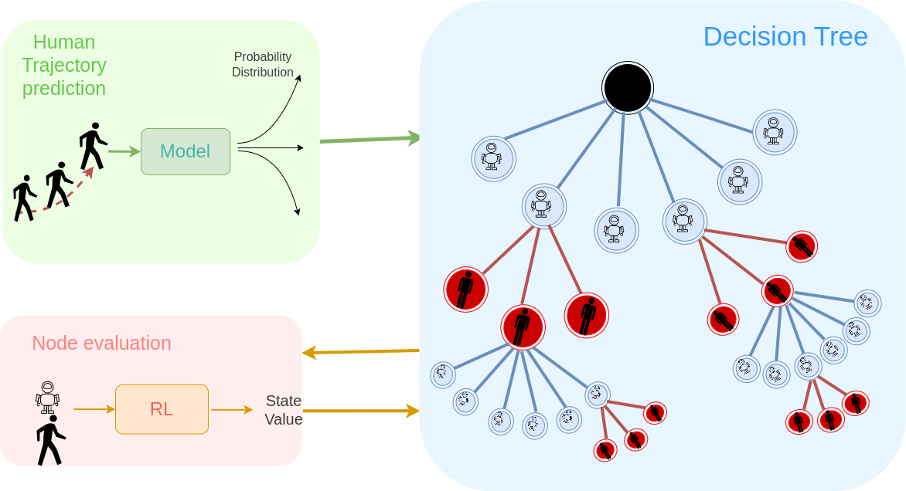

# Adapting to Frequent Human Direction Changes in Autonomous Frontal Following Robots

This repository implements the approach proposed in my paper [1] to address the challenges of robot follow-ahead applications, where human behavior can be highly variable and unpredictable. Our method leverages a decision-making technique to improve the robot's ability to navigate effectively in front of a person.

## Overview
A novel methodology is developed comprising three integrated modules: RL, LSTM, and MCTS. This approach introduces a unique consideration of distinct action spaces for humans and robots, enabling the system to dynamically capture and adapt to sudden changes in human trajectories with reasonable probability. This integration builds on prior work [2] by improving responsiveness and adaptability, addressing challenges in scenarios with frequent and unpredictable human direction changes. 

## Key Modules

### Tree Expansion:
Monte Carlo Tree Search (MCTS) is used to determine optimal actions for a robot following a person ahead. This approach enhances traditional MCTS by integrating a trained reinforcement learning (RL) model for node evaluation and an LSTM-based model to predict human action probabilities. By combining these elements, the method improves decision-making accuracy and robustness, enabling the robot to effectively balance exploration and exploitation in complex, dynamic scenarios.

At each time step, the system expands a tree with two layers: robot nodes and human nodes. 
Robot nodes represent possible actions or states of the robot.
Human nodes represent potential states or movements of the person being followed.
While expanding the tree and creating new leaf nodes, the safety of each node is evaluated. If a node directs the robot toward an unsafe region, it is removed from the tree.
The RL model evaluates each node to estimate its value.
The Human Trajcetory Prediction model assigns probabilitis to human nodes.

The expansion process is done by MCTS at a frequency of 5 Hz.
After expanding the tree, the child node with the highest visit count and expansion is chosen as the optimal action for the robot.
A new tree is expanded based on the updated state and inputs.

### Reinforcement Learning (RL) Model:
Reinforcement Learning (RL) solves sequential decision-making problems using value functions to predict accumulated rewards for a policy. 
Evaluates the quality of tree nodes during the tree expansion.
An agent is trained using the Asynchronous Actor-Critic (A2C) method to
learn a policy and its corresponding value function. Then
this value function is integrated with the tree expansion process
to evaluate different human-robot poses and assign a value to
each node in the tree. This approach helps the robot navigate
in front of the human while ensuring safety.

### Human Trajcetory Prediction Model:
An LSTM-fc model is trained specifically to sample a human’s position over a three-second interval and generate probabilities for their next possible actions.
The fully connected layer attached to the LSTM enables the model to output the likelihood of the human walking straight, turning right, or turning left. For training, 
the Human3.6M dataset is employed [3].

Case Study: Consider a scenario where the human has
been turning to the right for the past few time steps, and
the robot is positioned on the human’s left side. There is
a high probability that the human will continue turning
right in the future. Without this module, the robot assumes
equal probabilities for turning left, right, and going straight,
leading it to prefer staying on the human’s left side in case
the human turns left. However, with this module, the higher
probability of the human turning right (compared to left or
straight) causes the tree to be primarily expanded with the
human leaf node indicating a right turn. Consequently, the
robot is more confident in turning right to navigate in front
of the human.

## License
This work is licensed under a [Creative Commons Attribution-NonCommercial 4.0 International License]

## Citation
[1] Leisiazar S, Razavi R, Park EJ, Lim A, Chen M. Adapting to frequent human direction changes in autonomous frontal following robots. 

[2] Leisiazar S, Park EJ, Lim A, Chen M. An MCTS-DRL Based Obstacle and Occlusion Avoidance Methodology in Robotic Follow-Ahead Applications. In2023 IEEE/RSJ International Conference on Intelligent Robots and Systems (IROS) 2023 Oct 1 (pp. 221-228). IEEE.

[3] Catalin Ionescu, Dragos Papava, Vlad Olaru, and Cristian Sminchisescu. Human3.6m: Large scale datasets and predictive methods for 3d human sensing in natural environments. IEEE transactions on pattern analysis and machine intelligence,36(7):1325–1339, 2013.
