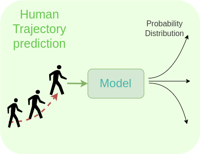

# Human Action Prediction with LSTM-fc

This repository contains the file to train the LSTM-fc model to predict the probabilities of a human's next possible action. 

## Overview
Incorporating the probability of a human's next possible action enhances the performance of the robot's decision-making process. This model predicts an individual human actions by training a Long Short-Term Memory (LSTM) model with a fully connected (fc) layer to generate accurate probabilities for a human's next directional move: walking straight, turning right, or turning left.

I trained the LSTM-fc model to first, sample a human's position over a three-second interval and then, generate probabilities for the next possible actions: walking straight, turning right, or turning left. The fully connected layer enables the model to output the likelihood of each action.

## Methodology
The Human3.6M dataset [1] is employed for training. The dataset, which includes different human motions, is filtered to use only the "walking" motion. The filtered dataset represents 2D positions of a walking person. The dataset’s original frequency of 50 Hz is reduced to 5 Hz. Sequences of 15 consecutive points (three seconds at 5 Hz) are extracted. Each sequence's final point is defined as the ground truth, the rest of the points used as the input for the model.

## Citation
If you use this code or approach in your research, please cite the following references:

## License
This project is licensed under the MIT License. See the LICENSE file for details.

## Acknowledgments
Special thanks to the creators of the Human3.6M dataset.

[1] Catalin Ionescu, Dragos Papava, Vlad Olaru, and Cristian Sminchisescu. Human3.6m: Large scale datasets and predictive methods for 3d human sensing in natural environments. IEEE transactions on pattern analysis and machine intelligence,36(7):1325–1339, 2013.
